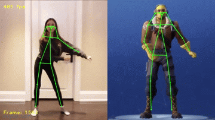
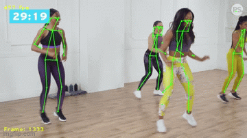

# Human pose detection 




This repo reimplements Openpose model for TensorRT framework on Windows Machine. It modifies pose detection program [1] developed by NVIDIA for Windows TensorRT Version. Pose detection model runs at up to 500fps on RTX-3070 GPU with 224x224 ResNet input size. For better accuracy, you need to train the openpose model with a bigger network input.

## Requirements
- Windows 10
- Visual Studio 2017
- RTX 3070 GPU
- TensorRT 7.2.1.6
- CUDA 11.1, Cudnn 8
- Python 3.7

## Installation

- Download the [TensorRT](https://developer.nvidia.com/nvidia-tensorrt-download) zip file that matches your Windows version.
- Install TensorRT by copying the DLL files from <tensorrt_path>/lib to your CUDA installation directory. For more information, refer to [TensorRT installation guideline](https://docs.nvidia.com/deeplearning/tensorrt/install-guide/index.html).
```
move <TensorRT_Installpath>/lib/*.dll C:\Program Files\NVIDIA GPU Computing Toolkit\CUDA\v11.1\bin
```

- Install [trt_pose](http://pytorch.org/) for parsing the trained pytorch model to an onnx graph model.
```
git clone https://github.com/NVIDIA-AI-IOT/trt_pose
cd trt_pose
python setup.py install
```
- Clone the github repo
```
cd ..
git clone https://github.com/batselem/Human_pose_detection
cd Human_pose_detection
```
- Download a pretrained resnet model, [resnet18_baseline_att_224x224_A](https://drive.google.com/file/d/1XYDdCUdiF2xxx4rznmLb62SdOUZuoNbd/view) and put it in the current project folder.
- Create an onnx model, optimize the model using TensorRT and build a runtime inference engine.
```
python convert2onnx.py -i resnet18_baseline_att_224x224_A_epoch_249.pth -o trt_pose.onnx
<tensorrt_path>/bin/trtexec.exe --onnx=trt_pose.onnx --explicitBatch --saveEngine=trt_pose_fp16.engine --fp16
```
- Open the solution with Visual Studio. Select `x64` and `Release` for the configuration and start building the project. 

## References
  - [1] https://github.com/NVIDIA-AI-IOT/trt_pose - Real-time pose estimation (Python and C++)
  - [2] https://github.com/CaoWGG/TensorRT-YOLOv4 - Object detection based on Tensorrt (C++)

